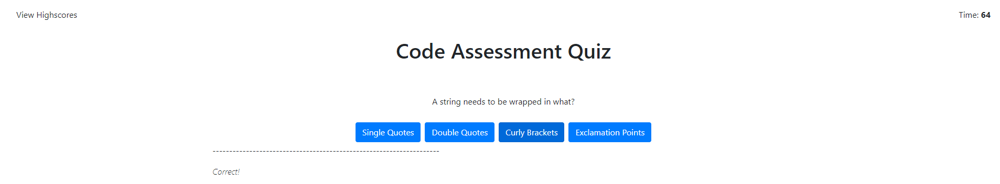

# FSB-CodingQuiz

## Purpose:
The purpose of this program is to create a timed Coding Assessment quiz that follows the following critera:
<ul>
    <li>When the start button is clicked: a timer starts counting down
    <li>Once an answer is selected, validation is performed on if it is correct or incorrect
    <li>Based on the validation two things may happen:
    <ul>
        <li>If wrong: Additional time is removed
        <li>The quiz moves on to the next question
    </ul>
    <li>When all answers are submitted, OR the timer hits 0 seconds remaining, I can input my initials and see my score
</ul>

## Language Used:
Primarily JavaScript for functionality, main page is HTML with minor CSS styling

### Psuedo Example:
When I'm asked a question, I'm presented with 4 buttons
Each button has a value to check against to determine if it is the correc button
The comparison tells me if the answer to the previous question was correct or wrong
Once the quiz is finished display the high scores of users who have done the quiz

#### Example Image

#### Link to live page
<a href="https://grimmedev.github.io/FSB-CodingQuiz/">JavaScript Quiz</a>
